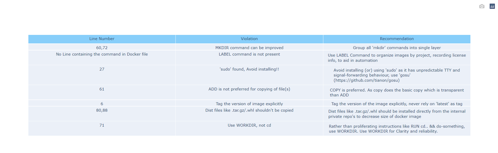

# Docker-violations

This is an open source project for the static analysis of vulnerabilities in Dockerfile, which improves the performance and layering in Dockerfile.

Currently tool can find violations in the below commands.

- FROM (IMAGE CHECK)
- LABEL
- MKDIR
- SUDO
- ADD
- WORKDIR
- DIST FILE CHECK (like .tar.gz/.wl)
- ENTRYPOINT

How to install it?

  - Download the "docker-violations-0.1.tar.gz" from "dist" directory.
  
  - Run "pip install docker-violations-0.1.tar.gz".

Docker Violations tool is installed.

How to Run it?

  python -m dockerviolations <Path of the Dockerfile in which violations to be found>
  
  Eg: python -m dockerviolations "C:\Dheeraj-PersonalData\My Git Hub Clones\docker-violations\Dockerfile"

Report Generation:

  After running the tool, report gets generated in a HTML page which gets opened automatically.
	
  This report comprises of line number(s) where the violation is present, type of violation and Recommendation.

Sample Report:

  
